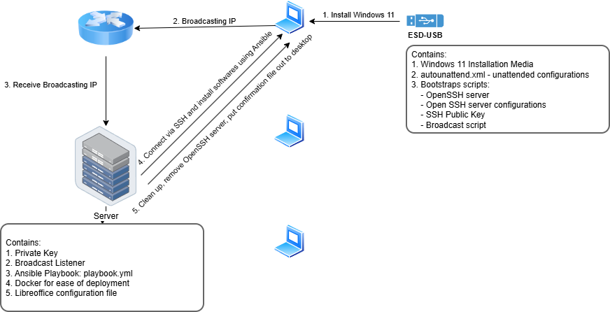

# Refurbify

## Overview
Refurbify is an Ansible-based automation project designed to streamline the deployment and configuration of Windows 11 systems for De Anza Refurbish Lab. It provides unattended installation with pre-configured network settings, bootstrap scripting, driver installing, and comprehensive system setup.

## Features
- Automated Windows 11 unattended installation including drivers, full updates, and hardware requirement bypasses.
- Pre-configured WiFi settings deployment
- SSH key-based authentication and OpenSSH server setup
- Bootstrap script integration for SSH setup and IP broadcasting
- Infrastructure-as-code approach using Ansible with Docker controller
- Client discovery using UDP broadcasts
- Software deployment and configuration: LibreOffice, Zoom, VLC, Firefox

## Workflow



## Complete Setup: Server, Client Bootstrap, and SSH Keys

### Prerequisites
- Ansible 2.9+
- Docker and Docker Compose (Docker Desktop for Windows/Mac)
- Windows 11 installation USB
- Network connectivity

### Clone the Repository (Skip if Already Cloned)

### Docker Desktop Setting for Windows/Mac

On Windows and Mac, Docker Desktop might runs on a WSL2 backend, which handles networking differently than a native Linux environment. As a result, the **client detection mechanisms** that depend on sending and receiving broadcast packets over the local network will not function properly in this setup.

To make this work on WSL2 backend, go to ```Settings → Resources → Network```, check the ```Enable host networking``` checkbox, and then click ```Apply & Restart```.

### Public/Private Key Setup

Generate a new SSH key without a passphrase (using Ed25519, recommended):

```bash
ssh-keygen -t ed25519 -C "your_email@example.com" -f ./ansible_ssh_key -N ""
```
- Copy the **public key** ```ansible_ssh_key.pub``` to ```ansible_boostrap_script\CompTechS``` folder
- Copy the **private key** ```ansible_ssh_key``` to ```ansible_server_files``` folder

### Server Setup

1. Open a terminal and navigate to the ```ansible_docker``` directory.
2. Run the following command to start the services defined in the Docker Compose file:
```bash
docker compose up
```
This command will build the ansible image (if they are not already built), create the containers, and start all services specified in the ```docker-compose.yml``` file. You should see the logs from each service directly in the terminal while the containers are running.

### Client Setup
1. Copy ```autounattend.xml``` and ```CompTechS``` into the root of Window 11 installation USB.
2. Rename the usb into: ```ESD-USB```
3. Boot the USB on the target laptop and let Windows install automatically, while you enjoy a cup of coffee.
